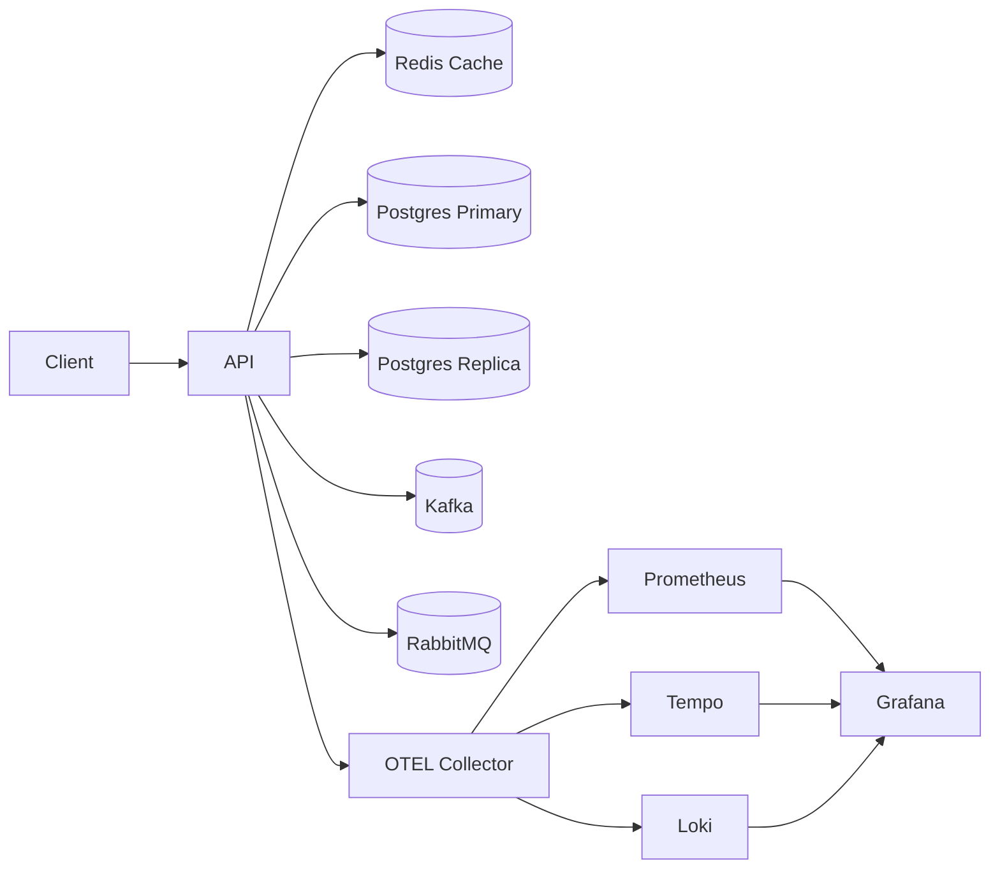

# **stock-management-service**

**stock-management-service** is a backend service designed to practice and demonstrate modern system engineering using a simple and realistic domain: **product and inventory management**.
The goal is to incrementally implement real-world backend patterns — consistency, concurrency, messaging, caching, observability, replication, and testing — all within a single cohesive project.

---

## **📌 Project Goals**

### **Data Consistency & Concurrency**

* Full CRUD for products
* Stock reservation using ACID transactions
* Row-level locking (`SELECT FOR UPDATE`)
* Table-level locking for administrative operations
* Deadlock handling with retry/backoff strategies

### **Database Architecture**

* PostgreSQL **primary + read replica** setup
* Automatic **read/write routing**
* **Read-after-write** mitigation patterns
* Replica lag handling + fallback strategies
* **Automated backups**

### **Caching & Performance**

* Redis-based read cache
* Cache invalidation strategies
* Rate limiting (Redis token bucket)
* Throttling to protect critical routes

### **Messaging**

* Product event publishing using **Kafka**
* Background job processing using **RabbitMQ**
* Dead-letter queue (DLQ) patterns
* Trace context propagation between services

### **Full Observability**

* End-to-end tracing with **OpenTelemetry**
* **Prometheus** for metrics
* **Grafana** for dashboards
* **Tempo** for distributed tracing
* **Loki** for structured logs

### **Testing & Reliability**

* Unit tests
* Integration tests
* Concurrency tests (stock reservation under load)
* E2E testing with Postman/Newman
* CI using docker-compose

---

## **📁 Repository Structure**

```text
/
├── apps/
│   └── api/                  # Main API (NestJS)
│
├── infra/
│   ├── docker/
│   │   ├── postgres-primary/
│   │   ├── postgres-replica/
│   │   ├── redis/
│   │   ├── kafka/
│   │   ├── rabbitmq/
│   │   ├── otel-collector/
│   │   ├── prometheus/
│   │   ├── grafana/
│   │   ├── tempo/
│   │   └── loki/
│   ├── docker-compose.yml
│   └── backups/
│
└── docs/
    ├── architecture/
    ├── decisions/
    └── dashboards/
```

---

## **🚀 Running the Project (Development Environment)**

> This section will be completed as each sprint is implemented.

Requirements:

* Docker + Docker Compose
* Node.js + pnpm
* Make (optional)

Initial setup:

```sh
cp .env.example .env
docker compose up -d
pnpm install
pnpm start:dev
```

Expected endpoints:

* API: `http://localhost:3000`
* Prometheus: `http://localhost:9090`
* Grafana: `http://localhost:3001`
* RabbitMQ UI: `http://localhost:15672`
* Kafka tools: via container CLI
* Tempo: `http://localhost:3200`

---

## **📚 Architecture Overview**



---

## **🧪 Testing Strategy**

Testing will be organized into:

### **Unit Tests**

Business logic, services, helpers.

### **Integration Tests**

Database, Redis, messaging systems, replica read routing.

### **Concurrency Tests**

High-load stock reservation scenarios to validate lock correctness.

### **E2E Tests**

Postman/Newman collections covering full application flows.

### **CI Pipeline**

* Spin up docker-compose
* Run migrations
* Execute Jest tests
* Execute Newman tests
* Shut down stack

---

## **📈 Observability**

The service will implement **complete observability**, including:

* Distributed tracing (OpenTelemetry)
* Custom & auto-instrumented metrics
* Structured logs (Pino → Loki)
* Prometheus scrapers
* Grafana dashboards

Dashboards will be exported to:

```text
docs/dashboards/
```

---

## **📝 Architectural Decisions (ADRs)**

All important decisions are documented under:

```text
docs/decisions/
```

Examples include:

* Choosing NestJS as the API framework
* Read/write replica routing strategy
* Why Kafka and RabbitMQ serve different purposes
* Locking and retry strategy
* Observability architecture

---

## **📌 Roadmap**

* [ ] Base infrastructure (compose + services)
* [ ] API skeleton
* [ ] Product CRUD
* [ ] Cache layer + invalidation
* [ ] Replica-aware read/write routing
* [ ] Stock reservation + locks
* [ ] Automated backups
* [ ] Kafka event publishing
* [ ] RabbitMQ worker + DLQ
* [ ] Complete observability stack
* [ ] Unit, integration, concurrency and E2E tests
* [ ] CI pipeline
* [ ] Final documentation + dashboards
