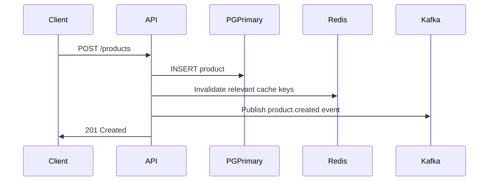
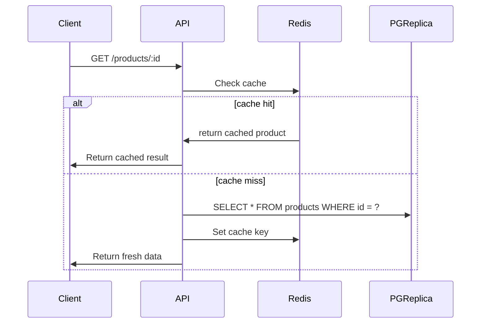
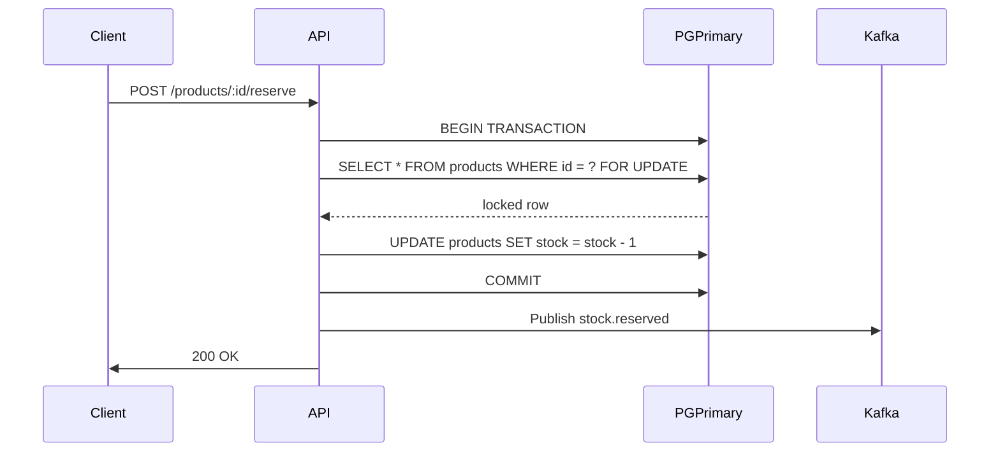
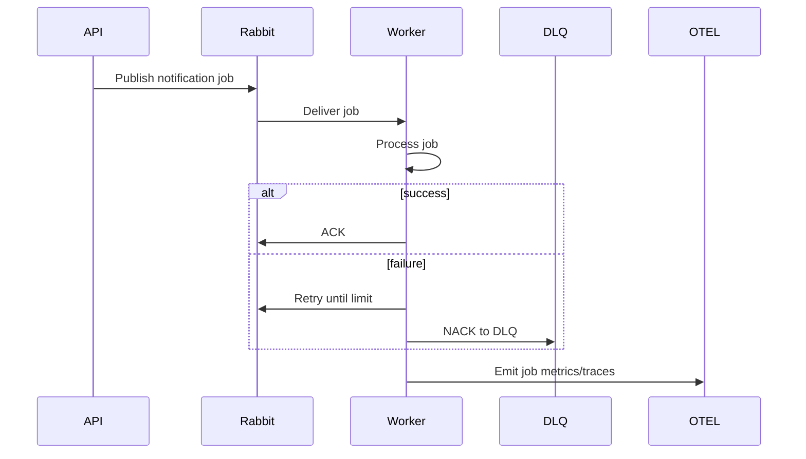

# **Data Flows — stock-management-service**

This document describes the core flows inside the system.

---

## **1. Product CRUD Flow**

Key concepts:

* Cache invalidation on writes
* Event publication for downstream consumers
* No business logic in the event publisher

---

## **2. Product Read Flow**

Key concepts:

* Cache-aside pattern
* Replica used only for reads
* Potential replica lag documented

---

## **3. Stock Reservation Flow (Critical Path)**

Key principles:

* Row lock guarantees consistency
* Deadlock handling (retry)
* Event emitted for audit processing

---

## **4. Messaging Flow — RabbitMQ Worker**

