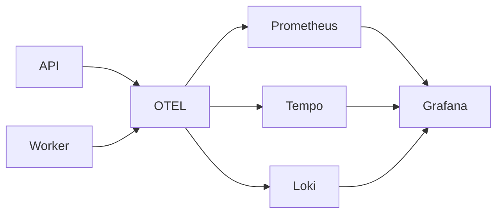

# **Observability Architecture — stock-management-service**

Observability is treated as a core feature.
This document explains how telemetry is collected, correlated, and visualized.

---

## **Telemetry Types**

### **1. Metrics (Prometheus)**

Collected via:

* Node.js OTel SDK
* prom-client
* DB metrics (connection pool)
* Messaging metrics (queue length, consumer lag)

Used for:

* Alerts
* Dashboards
* Performance SLOs

---

### **2. Traces (Tempo)**

Traces cover:

* Incoming HTTP requests
* Database queries
* Cache operations
* Kafka publishing
* RabbitMQ message processing

Context propagation is **mandatory**.

---

### **3. Logs (Loki)**

Logs are:

* Structured
* JSON-only
* Enriched with `trace_id` and `span_id`

This allows:

* Click → trace → logs correlation in Grafana

---

## **Observability Pipeline**

---

## **Dashboards**

The project includes Grafana dashboards for:

* API latency (P50/P95/P99)
* Error rate
* Redis hit/miss ratio
* DB replica lag
* Kafka consumer lag
* RabbitMQ queue depth
* Worker job metrics
* System-level traces

Dashboards are exported into `docs/dashboards/`.
